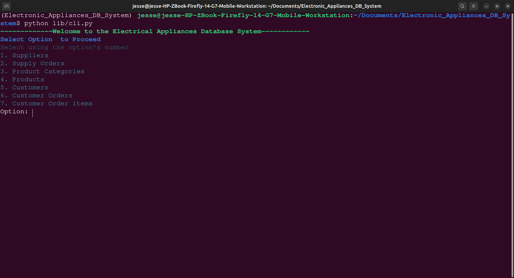
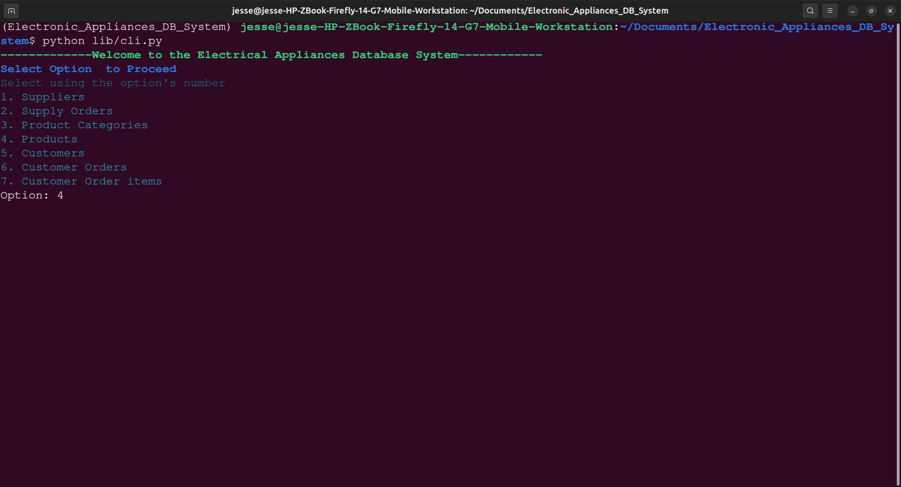
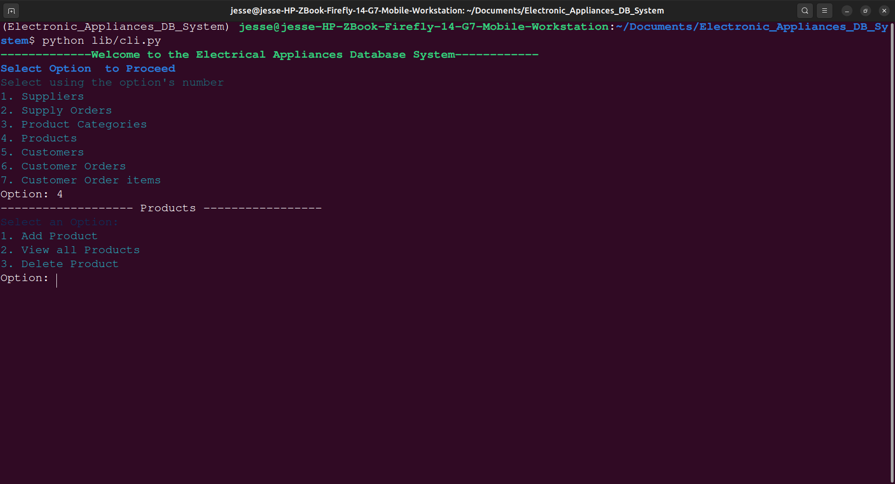
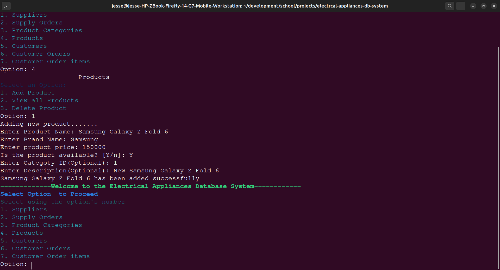

# ELECTRICAL APPLIANCES DATABASE SYSTEM
## Description
- This is a database system for a company consisting of Suppliers, Products, Customers and their details.

It consist of:
1. A database file containing the data from CRUD Operations(Create, Read, Update, Delete).
2. A Models file(models.py) that deals with defining the database.
3. A CRUD file(crud.py) that deals with defining the operations on the operations.
4. A CLI file(cli.py) that defining the running app in the Command Line.

- Several test were carried out on the app to ensure good functionality.


## Requirements and Prerequisites:
- A Computer
- Basic knowledge of navigating in the command line
- Python installed in your computer. (Python version 3 recommended)
- Sqlite installed in your computer
- Google Chrome(Not required for the running of the app but for viewing the database )


## Installation instructions:
1. Open the terminal in your system and navigate your desired directory.

    ``` cd <name_of_desired_directory> ```

* If you want the app in a new directory just create a new directory using mkdir command
Example:
    ``` mkdir <name_of_desired_directory> ```

2. In your directory run the command below to clone the app into your local system.
    ``` git clone git@github.com:JesseJames-Git/Electronic_Appliances_DB_System.git ```

3. Navigate to the newly created folder(Electronic_Appliances_DB_System) using this command.
    ``` cd Electronic_Appliances_DB_System ```


## Setup Instructions
1. Firstly, run this command in the command line in this apps directory to install required dependancies and virtual environment.
    ``` pipenv install ```

2. Run the command below to put your project in a virtual environment.
    ``` pipenv shell ```

3. Navigate to the db file:
    ``` cd lib/db/ ```

3. Run the command below to create the database.
    ``` alembic upgrade head ```

4. Navigate a directory upwards:
    ``` cd .. ```

5. - Run this command to some data to work with in the database:
    ``` python seed.py ```

6. Run this command to run the CLI app:
    ``` python cli.py ```

- You now have the required step-up of the app. It is ready for usage


## Basic Usage
- You should see now something like this:



- Ensure you follow the navigational options given. For example if you would like to add a Product use the number of the option. In the product option's case it is option number four. Write the number "4" as it is as shown:



- This will take you to the Product option's various interaction options(Add Product, View all Products and Delete Product) as shown:



- To add product simply select the option's number (1) and input the details needed by the app e.g: name, brand, etc.

Example:



- The product has now been added to the Database successfully. If an error will occur in any of the operations. You shall receive a message on what went wrong during input.

Now feel free to interact with the application using the options given.

### NOTE :
- If you would like to exit the app or an operation press ctrl + z.
- This app does not accept inline editing. If you have made a mistake in input, you have to erase the input value entirely using backspace.
- Make deletions and updates carefully to maintain data integrity.


## Viewing the Database
This database is made using sqlite hence there are multiple ways of viewing it.

My preferred method is by using an extension on google chrome called <a href url="https://chromewebstore.google.com/detail/sqlite-browser/iclckldkfemlnecocpphinnplnmijkol">SQlite Browser<a href>.
- Install the extension and in it simply browse your files till ou get your .db file ;in this case "company_system.db".
- Select the file to see the database file shown in the browser.


## Author
- The entire project was done by Jesse James Kang'ethe Macibi (Developer in learning).
- If you have any questions on issues on the app or if you would like to make contributions to the app, contact me through my email.

Email: jessejamesjj007@gmail.com


## License
MIT License

Copyright (c) 2025 JesseJames-Git

Permission is hereby granted, free of charge, to any person obtaining a copy
of this software and associated documentation files (the "Software"), to deal
in the Software without restriction, including without limitation the rights
to use, copy, modify, merge, publish, distribute, sublicense, and/or sell
copies of the Software, and to permit persons to whom the Software is
furnished to do so, subject to the following conditions:

The above copyright notice and this permission notice shall be included in all
copies or substantial portions of the Software.

THE SOFTWARE IS PROVIDED "AS IS", WITHOUT WARRANTY OF ANY KIND, EXPRESS OR
IMPLIED, INCLUDING BUT NOT LIMITED TO THE WARRANTIES OF MERCHANTABILITY,
FITNESS FOR A PARTICULAR PURPOSE AND NONINFRINGEMENT. IN NO EVENT SHALL THE
AUTHORS OR COPYRIGHT HOLDERS BE LIABLE FOR ANY CLAIM, DAMAGES OR OTHER
LIABILITY, WHETHER IN AN ACTION OF CONTRACT, TORT OR OTHERWISE, ARISING FROM,
OUT OF OR IN CONNECTION WITH THE SOFTWARE OR THE USE OR OTHER DEALINGS IN THE
SOFTWARE.